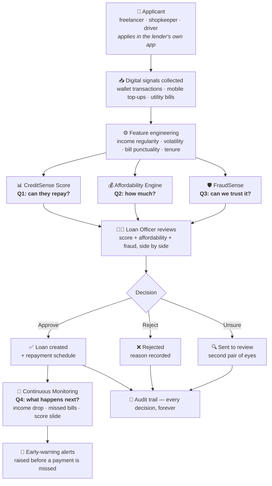
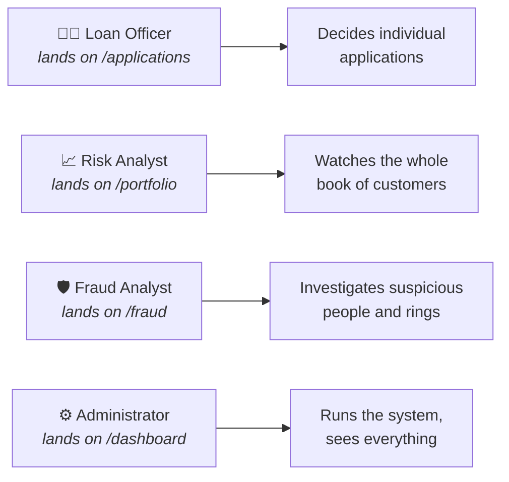
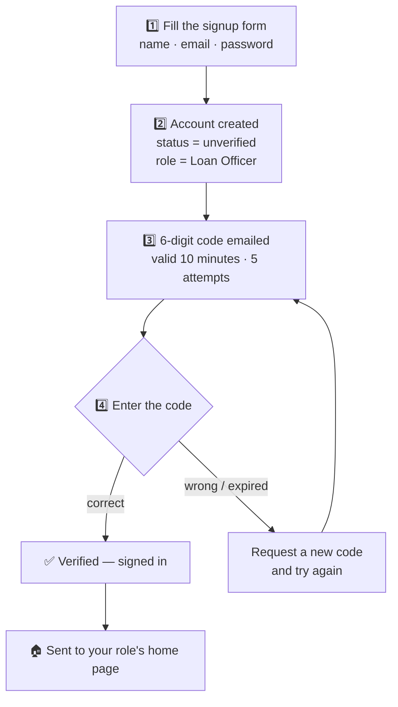
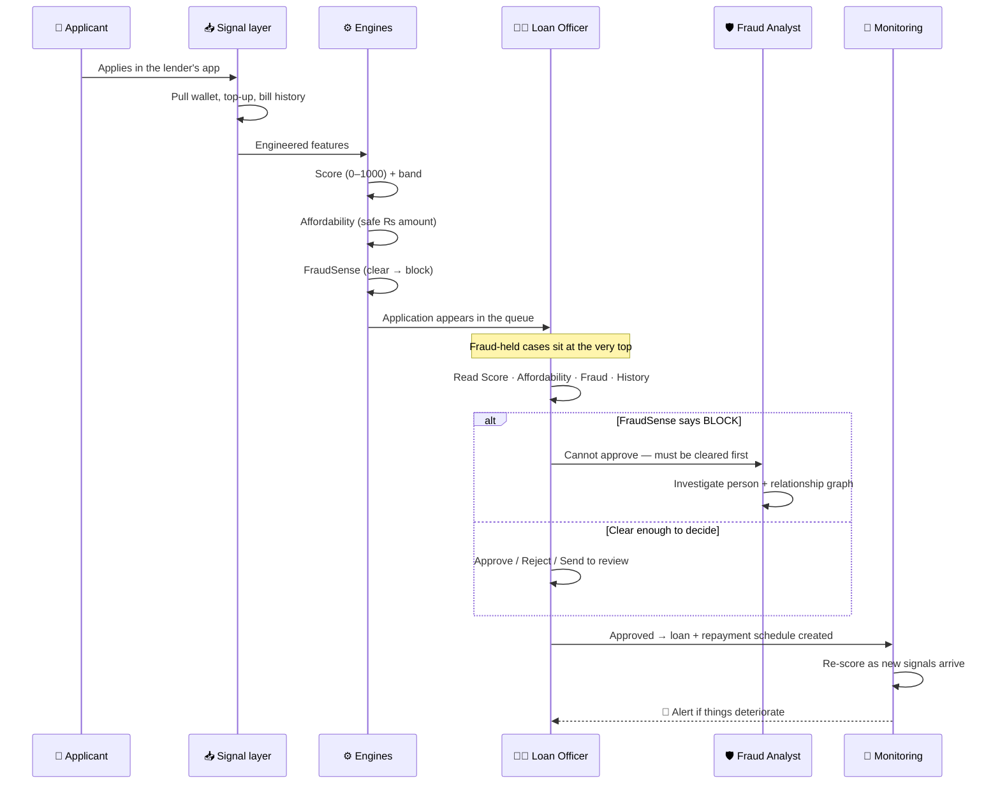
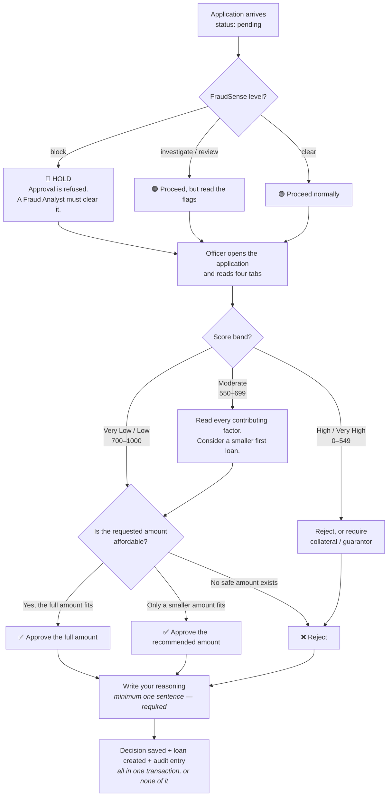
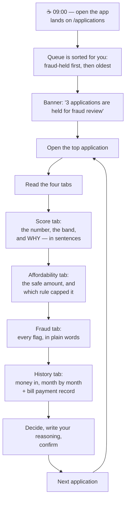
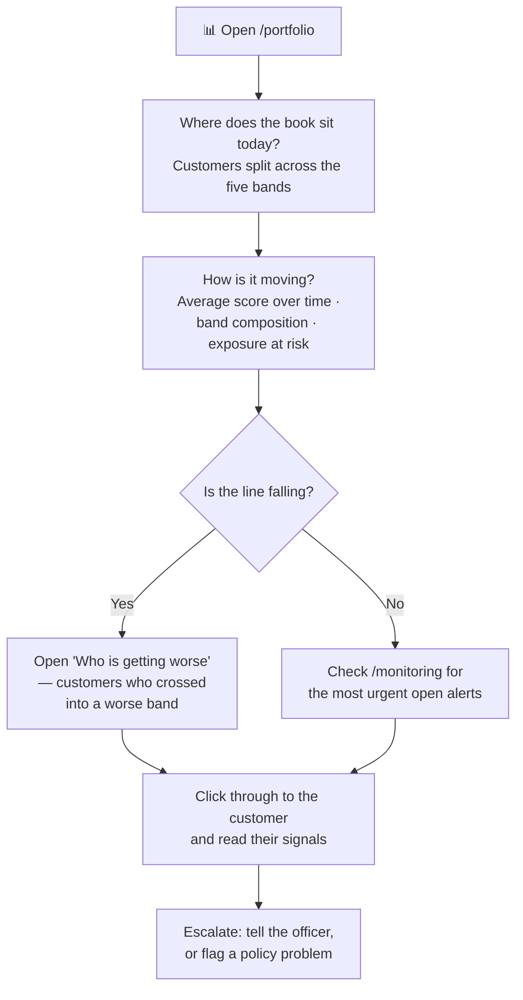
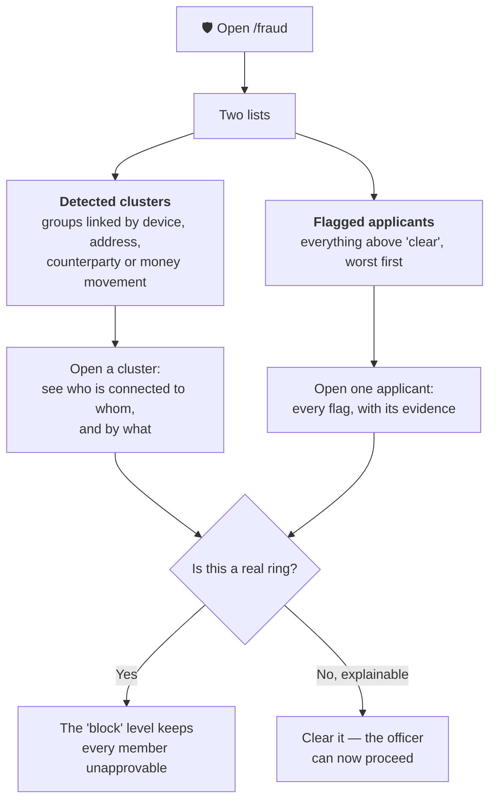
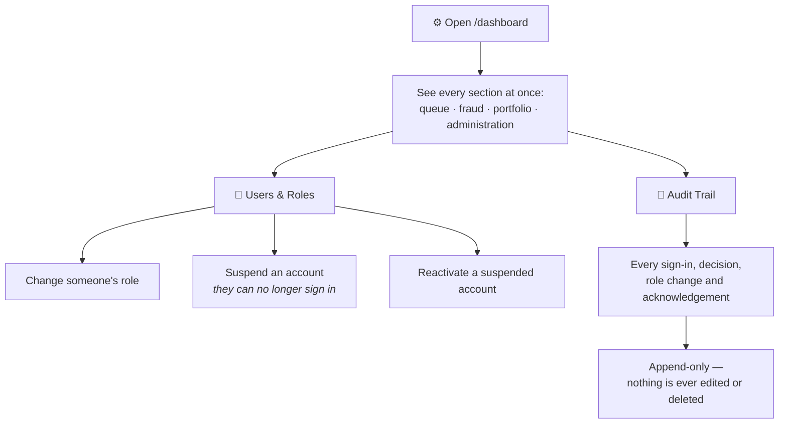
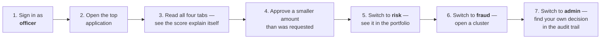

# CreditSense AI — How the App Works

**A plain-language guide to the whole product: what it is for, who uses it, and exactly what each person does, screen by screen.**

> No jargon. If you have never seen the app before, start at the top and read down. If you already know it, jump to your role in [Part 6](#part-6--role-playbooks-a-day-in-the-life).

📄 [Problem Statement](problem.md) · 🛠 [Tech Stack](TECH_STACK.md) · ⚙️ [Setup](SETUP.md) · 🏗 [Build Phases](../README.md)

---

## Contents

| Part | What it covers |
|------|----------------|
| [1](#part-1--what-this-app-is-in-one-minute) | What this app is, in one minute |
| [2](#part-2--the-big-picture-one-diagram) | The big picture — one diagram |
| [3](#part-3--who-uses-it-the-four-roles) | Who uses it — the four roles |
| [4](#part-4--getting-in-accounts-and-sign-in) | Getting in — accounts and sign-in |
| [5](#part-5--the-journey-of-one-application) | The journey of one application, start to finish |
| [6](#part-6--role-playbooks-a-day-in-the-life) | Role playbooks — a day in the life |
| [7](#part-7--the-four-engines-explained-simply) | The four engines, explained simply |
| [8](#part-8--the-screens-what-each-page-is-for) | The screens — what each page is for |
| [9](#part-9--rules-the-app-enforces-for-you) | Rules the app enforces for you |
| [10](#part-10--how-to-actually-use-it-hands-on) | How to actually use it — hands on |
| [11](#part-11--faq) | FAQ |

---

## Part 1 — What this app is, in one minute

Imagine a shopkeeper in Lahore. She earns well. She pays her electricity bill on time every month. Money moves through her JazzCash wallet every single day.

She walks into a bank and asks for a ₨150,000 loan.

The bank asks for a salary slip. She doesn't have one. It checks the credit bureau. She's never had a loan, so there's nothing there. **Rejected** — not because she is risky, but because she is *invisible*.

**CreditSense AI makes her visible.**

It reads the digital footprint she already leaves behind — wallet transactions, mobile top-ups, utility bill payments — and turns it into four answers a lender can actually act on:

```
   1. Can this person repay?              →  CreditSense Score    (0–1000)
   2. How much can they safely borrow?    →  Affordability Engine (₨ amount)
   3. Can we trust this application?      →  FraudSense           (clear → block)
   4. What happens after we lend?         →  Monitoring           (early warnings)
```

**Who is it for?** Banks, microfinance institutions, digital lenders, BNPL apps, and fintechs that want to lend to people with no credit history — safely.

**Who logs in?** Bank staff only. Four kinds of them. The borrower **never** logs into this app — they apply through the lender's own customer app, and their application lands in this dashboard.

---

## Part 2 — The big picture (one diagram)



**The one-line version:** signals go in → three engines analyse them → a human decides → the loan is watched for as long as it lives → everything is written down permanently.

---

## Part 3 — Who uses it: the four roles

Four kinds of staff log in. Each one gets a **different app** — different home page, different menu, different powers. Nobody sees more than their job needs.



### In their own words

| Role | "My job in one sentence" | Can they approve a loan? |
|------|--------------------------|--------------------------|
| **Loan Officer** | *"I look at one person at a time and say yes or no."* | ✅ **Yes** |
| **Risk Analyst** | *"I don't decide loans. I watch whether the whole book is getting healthier or sicker."* | ❌ No — read-only |
| **Fraud Analyst** | *"I decide whether this person is who they say they are, and whether they're working with others."* | ❌ No — but a `block` stops approval |
| **Administrator** | *"I manage the people who use this system, and I can see every single thing that happened."* | ✅ Yes (holds every permission) |

### Exactly what each role can see and do

Permissions — not roles — control everything. A tick means that role holds that permission.

| Permission | What it unlocks | 🧑‍💼 Officer | 📈 Risk | 🛡️ Fraud | ⚙️ Admin |
|------------|-----------------|:---:|:---:|:---:|:---:|
| `applications:read` | See the application queue and detail pages | ✅ | ✅ | ✅ | ✅ |
| `applications:decide` | **Approve / reject / send to review** | ✅ | — | — | ✅ |
| `customers:read` | See a customer's full signal profile | ✅ | ✅ | ✅ | ✅ |
| `portfolio:read` | Portfolio Risk page — distribution & trends | — | ✅ | — | ✅ |
| `monitoring:read` | Monitoring page + acknowledge alerts | ✅ | ✅ | — | ✅ |
| `fraud:read` | See fraud flags and the FraudSense page | ✅ | ✅ | ✅ | ✅ |
| `fraud:investigate` | Work a fraud case in depth | — | — | ✅ | ✅ |
| `audit:read` | The audit trail | — | — | — | ✅ |
| `users:manage` | Invite users, change roles, suspend | — | — | — | ✅ |
| `settings:manage` | System configuration | — | — | — | ✅ |

> **Why permissions instead of roles?** The code never asks *"is this person an admin?"* — it asks *"does this person hold `applications:decide`?"*. That means adding a fifth role later is one table edit, not a codebase-wide hunt. See [roles.ts](../src/lib/auth/roles.ts).

> **Important:** hiding a menu item is a *convenience*, not security. Every data request is re-checked on the server. Typing a URL you shouldn't have gets you the **No access** page, not the data.

### The menu each role actually sees

```
🧑‍💼 LOAN OFFICER          📈 RISK ANALYST          🛡️ FRAUD ANALYST        ⚙️ ADMINISTRATOR
   ├ Dashboard               ├ Dashboard               ├ Dashboard              ├ Dashboard
   ├ Applications  ★         ├ Applications            ├ Applications           ├ Applications
   ├ Customers               ├ Customers               ├ Customers              ├ Customers
   ├ Monitoring              ├ Portfolio Risk ★        ├ FraudSense  ★          ├ Portfolio Risk
   ├ FraudSense              ├ Monitoring              └ Settings               ├ Monitoring
   └ Settings                ├ FraudSense                                       ├ FraudSense
                             └ Settings                                         ├ Audit Trail
                                                                                ├ Users & Roles
   ★ = where you land after login                                               └ Settings
```

On a **phone**, the same menu becomes a bottom bar with four items (Home · Queue · Risk · Alerts) plus a **More** sheet. Nothing is ever missing — just arranged differently.

---

## Part 4 — Getting in: accounts and sign-in

### Path A — Sign up with email (the default)



Two things worth knowing:

- **Everyone starts as a Loan Officer.** That is the fixed default for every new account. An Administrator changes it afterwards from **Users & Roles**.
- **Your account must be verified before it can do anything.** An unverified account can't get into the dashboard.

### Path B — Continue with Google

One click. If it is a brand-new email, an account is created for you (again as Loan Officer) and it's verified immediately — Google already proved you own the inbox. If the email already exists, Google is simply linked to it.

### Path C — Forgot your password

```
  Forgot password  →  6-digit code to your inbox  →  Enter code + new password  →  Signed in
                       (10 min · 5 attempts)
```

### After you sign in

You never choose a home page — the app picks it from your role:

| Your role | You land on |
|-----------|-------------|
| Loan Officer | **/applications** — your decision queue |
| Risk Analyst | **/portfolio** — portfolio risk |
| Fraud Analyst | **/fraud** — FraudSense |
| Administrator | **/dashboard** — the overview |

If your account is **suspended**, sign-in fails with a message telling you to contact your administrator.

---

## Part 5 — The journey of one application

This is the single most important flow in the product. Follow one application from submission to a live, monitored loan.



### The same thing as a decision flowchart



### What the application status can be

```
      ┌─────────┐  officer sends to review   ┌───────────┐
      │ pending │ ─────────────────────────► │ in_review │
      └────┬────┘                            └─────┬─────┘
           │                                       │
           │ approve / reject               approve│reject
           ▼                                       ▼
      ┌──────────┐                           ┌──────────┐
      │ approved │  ← loan + schedule made   │ rejected │
      └──────────┘                           └──────────┘

      Both are FINAL. A decided application can never be decided again —
      the app returns "already approved / already rejected" and refuses.
```

`withdrawn` also exists, for applications the customer pulls back themselves.

---

## Part 6 — Role playbooks: a day in the life

### 🧑‍💼 The Loan Officer

**You land on:** the Application queue. **Your job:** turn scores into yes or no.



**The four tabs on an application, in plain words:**

| Tab | The question it answers | What you see |
|-----|-------------------------|--------------|
| **Score** | Can they repay? | A 0–1000 number, a colour band with a written verdict, and every factor that pushed the score up or down — each with its exact point contribution |
| **Affordability** | How much can they safely borrow? | The recommended loan, the maximum, the monthly instalment, and **which single rule capped it** |
| **Fraud** | Can we trust this? | The fraud level, a risk score out of 100, and each flag written as a sentence |
| **History** | Does the story hold up? | Money in month by month, the utility bill record, top-ups, and recent wallet activity |

**The three buttons at the bottom of the page:**

| Button | When to use it | What happens |
|--------|----------------|--------------|
| **✅ Approve** | The score, affordability and fraud picture all support it | Application → `approved`, a loan is created with a full instalment schedule, monitoring begins |
| **❌ Reject** | The signals say this loan will go bad | Application → `rejected`. Your reasoning becomes the adverse-action record |
| **🔍 Send to review** | You are genuinely unsure | Application → `in_review`. Say *what* you're unsure about, so the reviewer knows where to look |

> **You cannot skip the reasoning.** Every decision needs at least one real sentence. Years later, "who approved this and why" must have an answer.

> **You can approve less than was asked.** If someone requests ₨300,000 but only ₨180,000 is safe, the page tells you so and you approve the smaller amount. This is the whole point of a separate affordability engine — the alternative is rejecting a perfectly good customer.

**You also get Monitoring.** After you lend, alerts about approved customers show up there. You acknowledge them, which takes them off the open feed and records that you saw it.

---

### 📈 The Risk Analyst

**You land on:** Portfolio Risk. **Your job:** you never touch a single loan — you watch all of them at once.



**The three questions your pages answer:**

| Question | Where | What it tells you |
|----------|-------|-------------------|
| *"How risky is our book right now?"* | Portfolio → Risk distribution | Every scored customer, bucketed into five bands, with the average score in each |
| *"Is it getting better or worse?"* | Portfolio → How it is moving | Daily snapshots of average score, band drift, and total outstanding exposure. **A falling line means the book is deteriorating faster than it's being replaced.** |
| *"Who specifically went bad?"* | Portfolio → Who is getting worse | Named customers who crossed into a different band. Downgrades first — that's why anyone opens this page in a hurry |

You can read every application, but **the approve/reject buttons don't exist for you.** That separation is deliberate: the person watching the risk is not the person taking it.

---

### 🛡️ The Fraud Analyst

**You land on:** FraudSense. **Your job:** decide whether to trust a person — and find the ones working together.



**The four fraud levels, and what each means for the Loan Officer:**

| Level | Risk score | What the officer can do |
|-------|-----------|-------------------------|
| 🟢 **clear** | 0–19 | Nothing found. Decide normally. |
| 🟡 **review** | 20–44 | Read the flags before deciding. |
| 🟠 **investigate** | 45–69 | Needs attention before approval is wise. |
| 🔴 **block** | 70–100, or any critical flag | **Approval is refused by the system.** Not a warning — the request is rejected. |

**Why clusters matter more than individuals:** one person sharing a device is odd. Six people sharing a device, an address, and the same counterparty, all applying the same week, is a **ring** — and it is *only* visible on the cluster view. No single application page can show you that.

**What the detectors look for** (each one produces a sentence, not just a score):

```
   Circular transfers            Money going round in a loop between the same people
   Activity spike                Sudden burst of activity right before applying
   Synthetic-looking history     Transactions too regular to be a real human
   Shared device                 Same device as other applicants
   Shared address                Same address as other applicants
   Large request, short history  Asking big with almost no track record
   Overstated income             Claimed income doesn't match what the wallet shows
   Possible structuring          Amounts split to stay under reporting thresholds
   Dormant then reactivated      Quiet for months, then suddenly alive
   Shared counterparties         Paying and being paid by the same set of people
   Part of a connected group     Belongs to a detected cluster
```

---

### ⚙️ The Administrator

**You land on:** the Dashboard. **Your job:** run the system. You hold every permission, so you can do anything the other three roles can — plus two things only you can.



**Users & Roles** is where a new signup stops being a default Loan Officer. The three actions are: **change role**, **suspend**, **reactivate**. Each one is written to the audit trail with your name on it.

**The Audit Trail** records:

| Category | Events |
|----------|--------|
| **Accounts** | signup · email verified · login · failed login · logout · password reset requested/completed · Google linked/signup |
| **Administration** | role changed · suspended · reactivated · invited |
| **Lending** | application approved · rejected · sent to review · viewed |
| **Risk** | score computed · customer re-scored · alert acknowledged |

Every row keeps the actor's **email and role as they were at the time** — so if that person is later deleted, the trail still says who made the decision.

---

## Part 7 — The four engines, explained simply

### 1️⃣ CreditSense Score — *"Can this person repay?"*

A number from **0 to 1000**. Higher is better.

Two facts make the number meaningful rather than arbitrary:

- **500 is a coin flip.** Even odds on whether they repay.
- **Every 90 points halves the odds of default.** So 590 is half as likely to default as 500, and 680 is a quarter as likely. That relationship holds everywhere on the scale, which is what makes *"they improved by 90 points"* a real statement rather than a vague one.

| Band | Score | Verdict in plain words | What to do |
|------|-------|------------------------|------------|
| 🟢 **Very Low Risk** | 850–1000 | Very likely to repay | Approve with standard terms |
| 🟢 **Low Risk** | 700–849 | Likely to repay | Minor weaknesses, nothing that should block |
| 🟡 **Moderate Risk** | 550–699 | May repay — review carefully | Read the factors. Consider a smaller first loan |
| 🟠 **High Risk** | 400–549 | Unlikely to repay | Only with reduced amount, collateral or guarantor |
| 🔴 **Very High Risk** | 0–399 | Very unlikely to repay | Lending at any amount is not advisable |

> **Colour never carries the meaning alone.** Every band ships with a label, a written verdict and an icon — so the meaning survives colour-blindness, greyscale printing, and being read aloud over the phone.

**The explanation is not an approximation — it *is* the model.** Every factor contributes a whole number of points that adds up exactly to the final score:

```
   Base points (every applicant starts here)          500
   ├─ Income regularity: very consistent             +120
   ├─ Bill payments: 18 months, never late            +95
   ├─ Wallet tenure: 3 years                          +60
   ├─ Income volatility: high month-to-month swing    −45
   └─ Recent activity: quieter than usual             −30
                                                    ─────
   CreditSense Score                                   700   →  Low Risk
```

*(Illustrative figures — the real contributions come from the fitted scorecard.)*

### 2️⃣ Affordability Engine — *"How much can they safely borrow?"*

A score says *whether*. It says nothing about *how much* — and conflating the two breaks lending in both directions: a high scorer gets offered more than their cash flow can carry, and a moderate scorer gets refused when a smaller loan would have been perfectly safe.

**The one idea that makes this engine different:** it sizes the instalment against a **bad month**, not an average one.

> An informal worker's average month is a fiction they cannot pay an instalment out of. The quiet month is the one that causes the default — so the quiet month is the one the loan has to survive.

Four ceilings are calculated. **The lowest one wins** — that's the "binding constraint" the page names for you.

| Rule | The cap | Why |
|------|---------|-----|
| **Debt-service ratio** | Instalment ≤ **35%** of a *bad* month's income (**22%** if the score already flags elevated risk) | The instalment has to survive the worst month, not the best |
| **Spare cash after commitments** | ≤ **60%** of what's genuinely left after existing bills and loans | Never commit every last rupee |
| **Income multiple** | ≤ **4× monthly income** | A first unsecured loan is capped regardless of how affordable the instalment looks. Stretching the term does not lift this |
| **Product ceiling** | ≤ **₨500,000** | Hard ceiling for an unsecured loan on behavioural data alone |

Plus: a **minimum loan of ₨10,000** (below that it isn't worth originating), **at least 4 months of wallet history**, tenor options of **6 / 9 / 12 / 18 / 24 months**, and a **15% safety margin** held back on the recommended offer.

**The interest rate is the price of the risk**, set by band: Very Low **24%** · Low **28%** · Moderate **34%** · High **42%** · Very High **48%**.

```
   Example — a shopkeeper asks for ₨300,000

   Average monthly income        ₨ 62,000
   Median month                  ₨ 58,000
   Bad month (what we use)       ₨ 41,000   ← underwritten against this
   Committed outflow             ₨ 14,000
   Spare in a bad month          ₨ 27,000

   Ceiling by debt-service ratio    ₨ 268,000
   Ceiling by spare cash            ₨ 232,000   ← LOWEST — this rule is binding
   Ceiling by income multiple       ₨ 248,000
   Ceiling by product cap           ₨ 500,000

   ➜ Recommended: ₨ 197,000 over 12 months (after the 15% safety margin)

   The officer sees: "Consider approving ₨197,000 rather than ₨300,000."
```

### 3️⃣ FraudSense — *"Can we trust this application?"*

Two halves that catch different things:

```
   ┌──────────────────────────┐        ┌──────────────────────────┐
   │  ANOMALY DETECTION       │        │  RELATIONSHIP GRAPH      │
   │  looks at ONE person     │   +    │  looks at CONNECTIONS    │
   │                          │        │                          │
   │  Does this behaviour     │        │  Are these people        │
   │  look real?              │        │  working together?       │
   └──────────────────────────┘        └──────────────────────────┘
              │                                    │
              └────────────────┬───────────────────┘
                               ▼
                     Risk score 0–100  →  clear / review / investigate / block
```

The score **saturates** rather than adding up linearly. The difference between zero flags and one flag matters enormously; the difference between three and four barely matters. A linear sum would let a handful of trivial flags out-score one critical one — so it doesn't use one.

### 4️⃣ Continuous Monitoring — *"What happens after the loan is given?"*

Traditional lending decides once and then finds out about trouble when a payment is missed. That's far too late. Monitoring re-scores approved customers as new signals arrive and raises an alert **before** the missed payment.

**The seven early warnings:**

| Alert | What triggered it |
|-------|-------------------|
| 📉 **Income collapse** | Money coming in has dropped sharply against their own history |
| 🧾 **Missed bill streak** | Utility bills going unpaid, several in a row |
| 😴 **Wallet dormancy** | The wallet has gone quiet — 35+ days is medium, 60+ is high |
| 📊 **Score deterioration** | The CreditSense score is sliding |
| ⚠️ **Affordability breach** | The instalment is now eating a dangerous share of their income |
| 💸 **Repayment missed** | An actual instalment was missed. 2 is high, 3+ is critical |
| 🪫 **Balance depletion** | The wallet is hitting zero on most days |

Each is rated **low / medium / high / critical**, and the feed shows the most urgent first.

**Acknowledging an alert** takes it off the open feed and records who did it and when. That record matters: *"nobody was told"* and *"somebody was told and did nothing"* are very different answers when a loan goes bad — and only the audit trail can tell them apart.

---

## Part 8 — The screens: what each page is for

| Page | Who sees it | In one sentence |
|------|-------------|-----------------|
| **Dashboard** | Everyone | What needs *your* attention today — the sections change by role |
| **Applications** | Officer · Risk · Fraud · Admin | The decision queue, fraud-held cases at the top |
| **Application detail** | Same | One applicant across four tabs, with the decide bar at the bottom |
| **Customers** | Officer · Risk · Fraud · Admin | Every applicant and the digital signals we can read about them |
| **Customer detail** | Same | The full profile: score, fraud, affordability, engineered signals, income by month, bill record, top-ups, recent wallet activity |
| **Portfolio Risk** | Risk · Admin | Where the book sits, how it's moving, and who is getting worse |
| **Monitoring** | Officer · Risk · Admin | The early-warning feed for customers who already have loans |
| **FraudSense** | Officer · Risk · Fraud · Admin | Detected clusters and flagged applicants |
| **Fraud detail** | Same | One case: every flag, its evidence, and the people connected to it |
| **Audit Trail** | Admin only | Every decision and account change, append-only |
| **Users & Roles** | Admin only | Change roles, suspend, reactivate |
| **Settings** | Everyone | Your profile, password and theme |
| **No access** | Anyone who tries a page they lack | A clear explanation, not a broken screen |

**Every page has designed loading, empty, error and no-permission states.** You never hit a blank screen — if there's no data yet, the page tells you *why* and what to run.

---

## Part 9 — Rules the app enforces for you

These are guard rails in the code, not policies in a manual. They cannot be clicked past.

| Rule | What happens if you try |
|------|-------------------------|
| **FraudSense `block` means block** | Approval is refused: *"A Fraud Analyst must clear it before it can be approved."* The fraud engine is not advisory |
| **A decision is final** | Re-deciding a decided application returns *"already approved / rejected"* and changes nothing |
| **Reasoning is mandatory** | At least one real sentence, on every decision, always |
| **A decision is all-or-nothing** | The status change, the loan, the instalment schedule and the audit entry are written in a single transaction. There is no such thing as an approved application with no loan |
| **Permissions are checked on the server** | A hidden menu item is convenience. The actual check runs on every request |
| **The audit trail is append-only** | Nothing in the codebase updates or deletes an audit row |
| **Verification codes expire** | 6 digits, 10 minutes, 5 attempts |
| **New accounts get a fixed default role** | Everyone starts as a Loan Officer. Only an admin can change it |

---

## Part 10 — How to actually use it, hands on

### Step 1 — Build the whole demo from nothing

```bash
npm run demo            # migrations → population → features → scores → fraud → monitoring → accounts
npm run demo -- --full  # same, but also refits the scorecard model (slower)
```

That one command runs eight stages in order:

```
   [1/8] Schema          Apply every migration
   [2/8] Population      Generate the synthetic Pakistani informal-worker population
   [3/8] Features        Turn raw transactions into engineered signals
   [4/8] Model           Refit the scorecard          (only with --full)
   [5/8] Scores          Score every customer
   [6/8] FraudSense      Run detectors + rebuild the relationship graph
   [7/8] Monitoring      Re-score live exposure, raise early-warning alerts
   [8/8] Staff accounts  Create one signed-in account per role
```

### Step 2 — Start the app

```bash
npm run dev             # http://localhost:3000
```

### Step 3 — Sign in as each role and see four different apps

| Email | Role | What you'll see |
|-------|------|-----------------|
| `officer@creditsense.pk` | Loan Officer | The decision queue |
| `risk@creditsense.pk` | Risk Analyst | Portfolio and monitoring |
| `fraud@creditsense.pk` | Fraud Analyst | FraudSense and the graph |
| `admin@creditsense.pk` | Administrator | Everything |

**Password for all four:** `CreditSense2026!`

> These are local demo accounts created by `npm run db:seed-users`. Re-run it with `-- --reset` to put the passwords back.

### Step 4 — Walk the story in this order



That seven-step walk covers all four questions, all four roles, and closes the loop from decision to permanent record.

### Useful commands, individually

```bash
npm run db:migrate      # apply migrations
npm run db:status       # which migrations have run
npm run db:seed         # generate the synthetic population
npm run db:features     # rebuild engineered features
npm run model:train     # refit the scorecard
npm run db:score        # re-score every customer
npm run db:fraud        # re-run fraud detectors + graph
npm run db:monitor      # re-run monitoring, raise alerts
npm run db:seed-users   # create/refresh the four demo accounts
npm run db:diagnose     # check the database is wired correctly

npm run verify          # typecheck + lint + build
npm run qa              # QA pass
npm run test:auth       # end-to-end auth flow
npm run test:decision   # end-to-end decision flow
```

Full environment setup is in [SETUP.md](SETUP.md).

---

## Part 11 — FAQ

**Does the borrower log in here?**
No. This dashboard is for lender staff only. Borrowers apply through the lender's own customer app; their application arrives in the queue.

**Why four roles instead of one admin account?**
Because the person taking the risk shouldn't be the person watching it, and the person investigating fraud shouldn't be able to approve loans. Separation of duties is the point — not bureaucracy.

**Can a Risk Analyst approve a loan?**
No. They can read every application and decide none of them. That's exactly what having roles is for.

**Can a Loan Officer override a fraud block?**
No. If FraudSense says `block`, approval is refused. A Fraud Analyst has to clear it first.

**Why approve less than the customer asked for?**
Because the alternative is rejecting a good customer over a number they made up. The affordability engine finds the amount that *is* safe, so a moderate applicant gets a smaller yes instead of a no.

**Why does it use a "bad month" instead of the average?**
Because informal income is lumpy, and nobody pays an instalment out of an average. The quiet month is the one that causes the default, so that's the month the loan is sized against.

**Is the score a black box?**
No. Every factor contributes a whole number of points that sums exactly to the final score, and each one is written out in a sentence. The explanation isn't a summary of the model — it's the model, rearranged.

**What if the model is wrong about someone?**
That's what the officer, the affordability engine and the four tabs are for. The model ranks and explains; a human decides and records why.

**Why is the audit trail append-only?**
A lending decision has to be reconstructable years later: who approved it, under what role, on what evidence, with what reasoning. If rows could be edited, none of that is worth anything.

**What happens on a phone?**
Everything works from 320px up. The sidebar becomes a bottom bar, tables become cards showing the three things that actually drive the decision, and charts simplify. A loan officer in the field is a real user, not an afterthought.

---

*This document explains how CreditSense AI is used. For **why** it exists, read the [Problem Statement](problem.md). For **how** it's built, read the [Tech Stack](TECH_STACK.md) and the [build phases](../README.md).*
